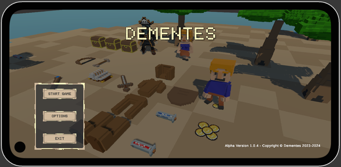
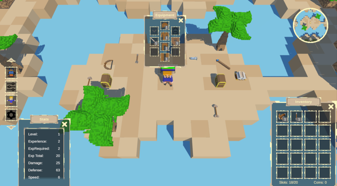
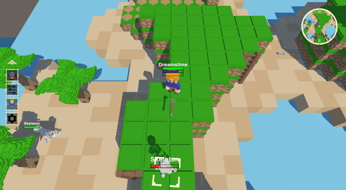
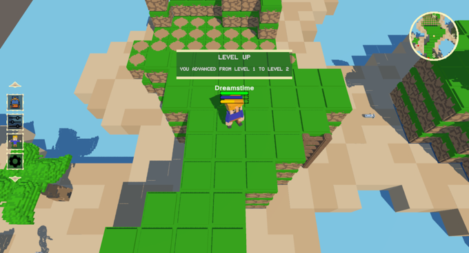
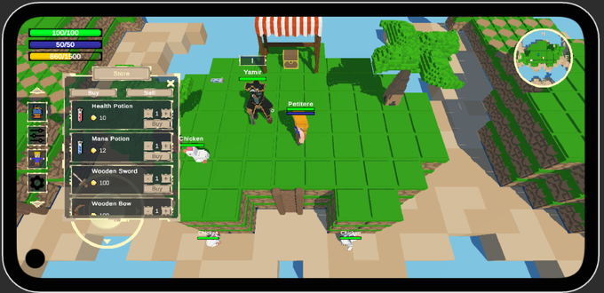
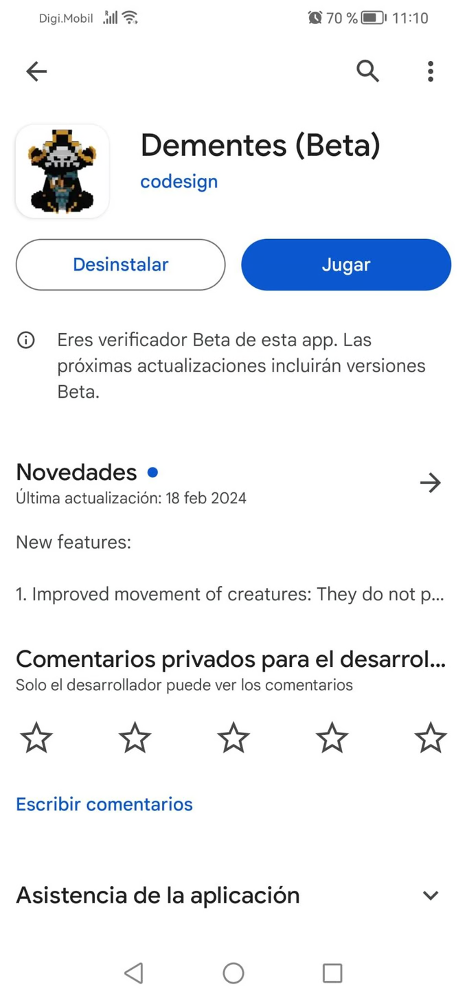
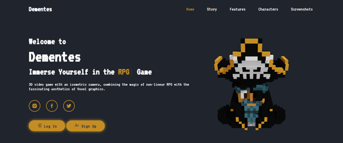

# 🎮 Dementes: Juego de Rol en Línea 3D

    

## 🚀 Descripción del Proyecto
**Dementes** es un juego de rol en línea (ORPG) en 3D no lineal que combina una estética voxel única con una narrativa inmersiva en un mundo abierto lleno de aventuras, magia y desafíos. Este juego permite a los jugadores explorar, combatir y colaborar con NPCs mientras desentrañan los secretos de un universo en constante evolución.

## 🌟 Funcionalidades Principales

### Características Actuales
- **Estilo Voxel Distintivo:** Gráficos estilizados que combinan el encanto retro con un diseño moderno para ofrecer una experiencia visual única.
- **Juego No Lineal:** Los jugadores tienen libertad para equipar a sus personajes con diferentes armas y armaduras, cambiando su estilo de juego según prefieran.
- **Sistema de Combate Estratégico:** Combate en tiempo real que requiere táctica y habilidad, añadiendo profundidad a cada enfrentamiento.
- **Exploración de Mundo Abierto:** Un mapa diverso que incluye regiones, mazmorras, misiones y secretos ocultos por descubrir.
- **Progreso Sincronizado en la Nube:** Gracias a Firebase, los datos del progreso del jugador están accesibles desde cualquier dispositivo compatible.

---

## ⚙️ Estructura del Proyecto

### Estructura Principal
#### Frontend:
- **Motor Gráfico:** Compatible con gráficos 3D y estética voxel, diseñado en Unity.
- **Interfaces de Usuario Intuitivas:** Menús y HUD diseñados para facilitar la navegación y mejorar la experiencia de juego.

#### Backend:
- **Firebase Realtime Database:** Gestiona la información del progreso del jugador, estadísticas y configuraciones de cuenta.
- **Integración con Unity:** Comunicación entre el motor de juego y Firebase para sincronizar datos en tiempo real.

#### Mecánicas de Juego:
- **Sistema de Decisiones:** Un árbol narrativo que permite personalizar la experiencia del jugador a través de elecciones significativas.
- **Diseño de Niveles:** Áreas dinámicas que incluyen desafíos adaptativos y secretos escondidos para mantener la exploración interesante.

---

## 💻 Requisitos

### Requisitos Técnicos
- **Plataformas Soportadas:**
  - Actual: Android.
  - Futuro: PC (Windows).
- **Motor de Juego:** Unity (versión 2021 o superior).
- **Lenguajes de Desarrollo:**
  - Frontend: C# Unity.
  - Backend: Realtime Firebase para lógica de servidor.
- **Conexión a Internet:** Requerida para jugar.

---

## 📷 Capturas de Pantalla

    
    
    
    

---

## 💡 Funcionalidades Futuras

### Mejoras Planificadas
- **Economía Dinámica y Comercio:** Sistema de fabricación de equipamiento y comercio con NPCs.
- **Eventos Temporales:** Desafíos únicos que cambian periódicamente para mantener el interés de los jugadores.
- **Cross-Platform Play:** Compatibilidad para jugar entre dispositivos móviles y PC.
- **IA Avanzada:** Enemigos y NPCs con comportamientos adaptativos y realistas.
- **Mazmorras Dinámicas:** Mazmorras que cambian su diseño con cada visita para mantener el desafío fresco.
- **Sistema de Logros:** Logros que recompensan a los jugadores por explorar, combatir y completar misiones.

---

## ▶️ Instrucciones de Ejecución

- **Instalación:** Dirígete a la [Play Store](https://play.google.com/store/apps/details?id=com.CodesignProjects.Dementes), descarga e instala el videojuego.

    

- **Configuración de Usuario:** Crea una cuenta dentro de la [página oficial](https://dementesgame.com/) y crea tu personaje inicial.

    

- **Inicio de Juego:** Inicia sesión con las credenciales que has creado y disfruta de la experiencia.

---

## 🔎 Ejemplos de Uso
- **Exploración Libre:** Los jugadores pueden recorrer áreas desconocidas, recolectar recursos y descubrir eventos ocultos.
- **Mazmorras:** Antes de ingresar a una mazmorra, equipa a tu personaje con las mejores armas y armaduras para maximizar tus posibilidades de éxito.
- **Gestión de Inventario:** Intercambia con NPCs, fabrica equipamiento y organiza tus objetos para optimizar tu experiencia de juego.

---
